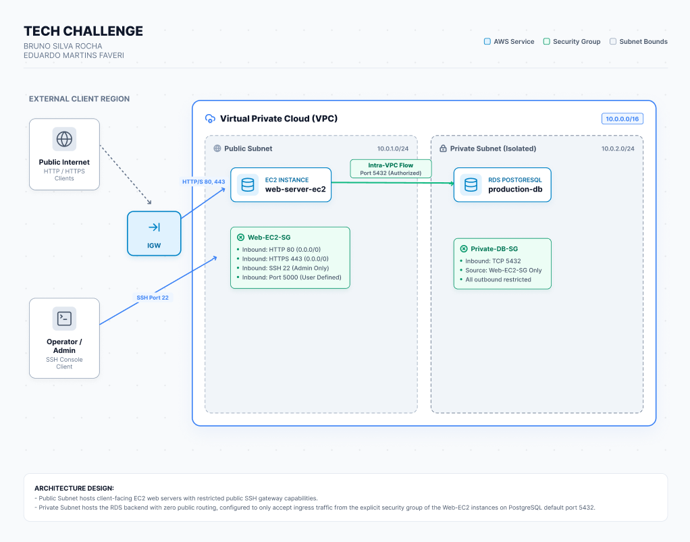

# 📝 Tech Challenge Fase 1

## 📋 Informações do Projeto
**Integrantes:**
- [Bruno Silva Rocha] - RM [376615]
- [Eduardo Martins Faveri] - RM [376068]

**Curso:** Pós-Tech FIAP - DevOps e Arquitetura Cloud
**Fase:** 1  
**Data:** [DD/MM/AAAA]

---

## 🎯 Objetivo

O desafio desta fase é colocar a aplicação monolítica do ToggleMaster no. Provisionar toda a infraestrutura na **AWS** para validar a ideia com uma API simples que permita criar, ler, atualizar e deletar feature flags. A equipe precisa colocar essa aplicação no ar rapidamente para receber feedback.

---

## 🏗️ Arquitetura da Infraestrutura

### Diagrama de Arquitetura

---

## Desafios encontrados e decisões tomadas

Entre os principais desafios encontrados durante o desenvolvimento do projeto, destacamos a seleção e a configuração dos serviços e recursos da AWS necessários para atender aos requisitos definidos. Foi necessário avaliar aspectos como a definição da VPC e de suas sub-redes, a configuração das tabelas de roteamento (route tables), os parâmetros da instância EC2 e a configuração do banco de dados PostgreSQL no Amazon RDS.

Também foi necessário estudar e aplicar boas práticas de segurança e configuração da infraestrutura. Nesse contexto, adotamos o princípio de **deny by default**, permitindo apenas os tipos de tráfego estritamente necessários para o funcionamento da aplicação. Um exemplo disso foi a configuração dos Security Groups, restringindo o acesso ao banco de dados para que somente a instância EC2 pudesse estabelecer conexões com o PostgreSQL.

Em relação às decisões tomadas, buscamos sempre considerar a relação entre **custo, desempenho, segurança e simplicidade da arquitetura**. Dessa forma, priorizamos recursos que fossem suficientes para atender aos requisitos do projeto sem adicionar complexidade ou custos desnecessários à infraestrutura.
